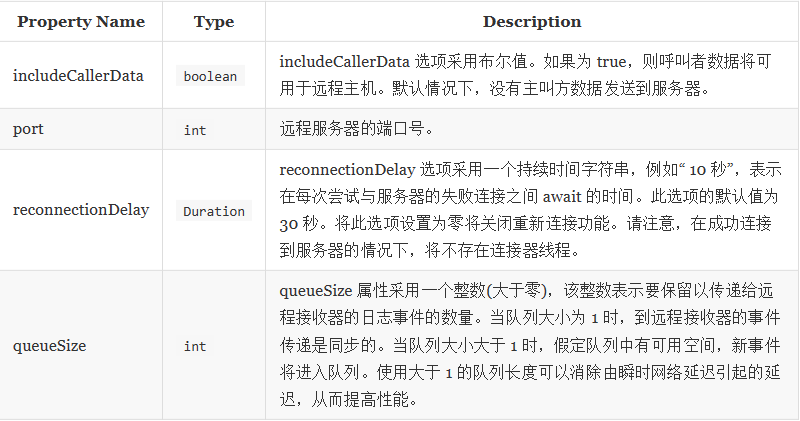
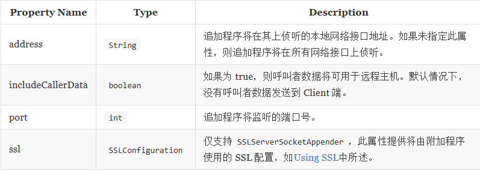

# SocketAppender 和 SSLSocketAppender
SocketAppender被设计为通过在线传输序列化的ILoggingEvent实例来logback到远程实体。使用SocketAppender时，线路上的日志记录事件以明文形式发送。但是，使用SSLSocketAppender时，日志记录事件是通过安全通道传递的。

序列化事件的实际类型是LoggingEventVO，它实现了[ILoggingEvent](http://logback.qos.ch/xref/ch/qos/logback/classic/spi/LoggingEventVO.html)接口。但是，就日志事件而言，远程日志是非侵入性的。在反序列化后的接收端，可以记录该事件，就好像它是本地生成的一样。在不同计算机上运行的多个SocketAppender实例可以将其日志输出定向到固定格式的中央日志服务器。 SocketAppender不采用关联的布局，因为它将序列化的事件发送到远程服务器。 SocketAppender在“传输控制协议”(TCP)*层之上运行，该层提供可靠的，有序的，流控制的端到端八位字节流。因此，如果远程服务器可访问，则日志事件最终将到达那里。否则，如果远程服务器已关闭或无法访问，则将简单地删除日志记录事件。如果服务器重新启动，则事件传输将透明地恢复。此透明重新连接由连接器线程执行，该连接器线程会定期尝试连接到服务器。

日志事件由本机 TCP 实现自动缓冲。这意味着，如果到服务器的链接很慢，但仍比 Client 端的事件产生速率快，则 Client 端将不会受到网络连接速度慢的影响。但是，如果网络连接的速度比事件产生的速度慢，则 Client 端只能以网络速度前进。特别是，在极端情况下，到服务器的网络链接已断开，最终将阻止 Client 端。或者，如果网络链接已打开，但服务器已关闭，则 Client 端将不会被阻止，尽管由于服务器不可用，日志事件也会丢失。

即使不再将SocketAppender附加到任何 Logger，也不会在存在连接器线程的情况下对其进行垃圾回收。仅当与服务器的连接断开时，连接器线程才存在。为避免此垃圾回收问题，应显式关闭SocketAppender。创建/销毁许多SocketAppender实例的长期应用程序应注意此垃圾回收问题。大多数其他应用程序可以放心地忽略它。如果托管SocketAppender的 JVM 在关闭SocketAppender之前(显式地或在垃圾回收之后)退出，则管道中可能存在未传输的数据，这可能会丢失。这是基于 Windows 的系统上的常见问题。为了避免丢失数据，通常在退出应用程序之前，显式close() SocketAppender或通过调用LoggerContext的stop()方法就足够了。

远程服务器由 remoteHost 和 port 属性标识。下表中列出了SocketAppender个属性。 SSLSocketAppender支持许多其他配置属性，有关详细信息，请参见标题为[Using SSL](https://www.docs4dev.com/docs/zh/logback/1.3.0-alpha4/reference/usingSSL.html)的小节。



另请参见 eventDelayLimit 属性。
| eventDelayLimit | Duration | eventDelayLimit 选项采用持续时间字符串，例如“ 10 秒”。它表示在本地队列已满(即已经包含 queueSize 事件)的情况下，丢弃事件之前要 await 的时间。如果远程主机持续缓慢地接受事件，则可能会发生这种情况。此选项的默认值为 100 毫秒。 |
| remoteHost | String |服务器的主机名。 |
| ssl | SSLConfiguration |仅针对SSLSocketAppender支持，此属性提供了将由附加程序使用的 SSL 配置，如[Using SSL](https://www.docs4dev.com/docs/zh/logback/1.3.0-alpha4/reference/usingSSL.html)中所述。 |


前面讨论的SocketAppender组件(及其支持 SSL 的组件)旨在允许应用程序通过网络连接到远程日志记录服务器，以便将日志记录事件传递到服务器。在某些情况下，让应用程序启动与远程日志记录服务器的连接可能不方便或不可行。对于这些情况，Logback 提供了ServerSocketAppender。

ServerSocketAppender而不是启动与远程日志记录服务器的连接，而是被动地侦听 TCP 套接字，以 await 来自远程 Client 端的传入连接。传递到附加程序的日志事件将分发到每个连接的 Client 端。没有 Client 端连接时发生的日志记录事件将被“暂时丢弃”。

除了基本的ServerSocketAppender，Logback 还提供SSLServerSocketAppender，它使用安全的加密通道将日志记录事件分发给每个连接的 Client 端。此外，启用 SSL 的附加程序完全支持基于相互证书的身份验证，可用于确保只有授权的 Client 端才能连接到附加程序以接收日志事件。

编码日志事件以在线上传输的方法与SocketAppender相同；每个事件都是ILoggingEvent的序列化实例。仅连接启动方向相反。 SocketAppender在构建与日志服务器的连接时充当主动对等方，而ServerSocketAppender是被动的；它侦听来自 Client 端的传入连接。

ServerSocketAppender子类型只能与 Logback * receiver *组件一起使用。有关此组件类型的更多信息，请参见Receivers。

ServerSocketAppender支持以下配置属性：


以下示例说明了使用ServerSocketAppender的配置：

示例：基本的 ServerSocketAppender 配置(logback-examples/src/main/resources/chapters/appenders/socket/server4.xml)
```mermaid xml
<configuration debug="true">
  <appender name="SERVER" 
    class="ch.qos.logback.classic.net.server.ServerSocketAppender">
    <port>${port}</port>
    <includeCallerData>${includeCallerData}</includeCallerData>
  </appender>

  <root level="debug">
    <appender-ref ref="SERVER" />
  </root>  

</configuration>

```
请注意，此配置与仅在为附加程序指定的* class *中使用SocketAppender的先前示例不同，并且没有 remoteHost 属性-该附加程序被动地 await 来自远程主机的入站连接，而不是打开与远程日志记录服务器的连接。

以下示例说明了使用SSLServerSocketAppender的配置。

示例：SSLServerSocketAppender 基本配置(logback-examples/src/main/resources/chapters/appenders/socket/ssl/server3.xml)
```mermaid xml
<configuration debug="true">
  <appender name="SERVER" 
    class="ch.qos.logback.classic.net.server.SSLServerSocketAppender">
    <port>${port}</port>
    <includeCallerData>${includeCallerData}</includeCallerData>
    <ssl>
      <keyStore>
        <location>${keystore}</location>
        <password>${password}</password>
      </keyStore>
    </ssl>
  </appender>

  <root level="debug">
    <appender-ref ref="SERVER" />
  </root>  

</configuration>

```

配置与以前的配置之间的主要区别在于，附加程序的* class *属性标识SSLServerSocketAppender类型，并且存在嵌套的 ssl 元素，该元素在此示例中指定了包含 X.509 凭证的密钥存储区的配置追加器。有关 SSL 配置属性的信息，请参见Using SSL。