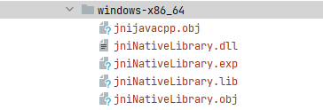

# JavaCPP调用C函数的完整示例
## 环境最要命，所有一切的症结都在C环境，编译器版本、一定要用C的编译器运行
## 添加依赖
* Maven (inside the `pom.xml` file)
```xml
  <dependency>
    <groupId>org.bytedeco</groupId>
    <artifactId>javacpp</artifactId>
    <version>1.5.8</version>
  </dependency>
```
## 访问本地api
最常见的用例包括访问一些为c++编写的本机库，例如，在名为`NativeLibrary.h`的文件中包含以下c++类:
```cpp
#include <string>

namespace NativeLibrary {
    class NativeClass {
        public:
            const std::string& get_property() { return property; }
            void set_property(const std::string& property) { this->property = property; }
            std::string property;
    };
}
```
**用JavaCPP完成工作**
```java
import org.bytedeco.javacpp.*;
import org.bytedeco.javacpp.annotation.*;

@Platform(include="NativeLibrary.h")
@Namespace("NativeLibrary")
public class NativeLibrary {
    public static class NativeClass extends Pointer {
        static { Loader.load(); }
        public NativeClass() { allocate(); }
        private native void allocate();

        // 调用getter和setter函数
        public native @StdString String get_property(); public native void set_property(String property);

        // 直接访问成员变量
        public native @StdString String property();     public native void property(String property);
    }

    public static void main(String[] args) {
        NativeClass l = new NativeClass();
        l.set_property("Hello World!");
        System.out.println(l.property());
    }
}
```
我们需要在执行它之前使用JavaCPP进行构建，我们可以让它像下面这样做:
```bash
$ java -jar javacpp-1.5.8.jar NativeLibrary.java -exec


Hello World!
```
执行成功之后会出现如图文件，将`jniNativeLibrary.dll`移动到`java.library.path`下，可通过`System.getProperty("java.library.path")`获取

