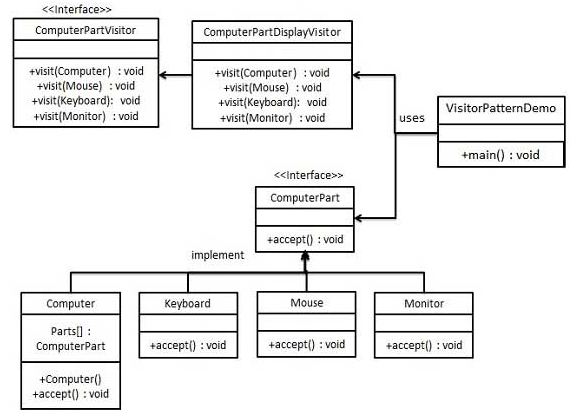

# 访问者模式
在访问者模式（Visitor Pattern）中，我们使用了一个**访问者类**，它改变了**元素类**的执行算法。通过这种方式，**元素**的执行算法可以随着**访问者**改变而改变。这种设计模式属于**行为型模式**。**元素对象**已接受**访问者对象**，这样**访问者对象**就可以处理**元素对象**上的操作。

## 介绍
**意图：** 主要将**数据结构**（元素）与**数据操作**（访问者）分离。

**主要解决：** 稳定的数据结构和易变的操作耦合问题。

**何时使用：** 需要对一个对象结构中的对象进行很多不同的并且不相关的操作，而需要避免让这些操作"污染"这些对象的类，使用访问者模式将这些封装到类中。

**如何解决：** 在**被访问的类**（元素）里面加一个对外提供接待访问者的接口。

**应用示例** 您在朋友家做客，您是访问者，朋友接受您的访问，您通过朋友的描述，然后对朋友的描述做出一个判断，这就是访问者模式。

**优点：** 1、符合单一职责原则。 2、优秀的扩展性。 3、灵活性。

**缺点：** 1、具体元素对访问者公布细节，违反了迪米特原则。 2、具体元素变更比较困难。 3、违反了依赖倒置原则，依赖了具体类，没有依赖抽象。

**使用场景：** 1、对象结构中对象对应的类很少改变，但经常需要在此对象结构上定义新的操作。 2、需要对一个对象结构中的对象进行很多不同的并且不相关的操作，而需要避免让这些操作"污染"这些对象的类，也不希望在增加新操作时修改这些类。

**注意事项：** 访问者可以对功能进行统一，可以做报表、UI、拦截器与过滤器。

**包含角色：** 抽象元素、具体元素、抽象访问者、具体访问者



**1。定义一个表示元素的接口**
```java
public interface ComputerPart {
   void accept(ComputerPartVisitor computerPartVisitor);
}
```
**2. 创建实现上述接口的实现类**
```java
public class Keyboard  implements ComputerPart {
 
   @Override
   public void accept(ComputerPartVisitor computerPartVisitor) {
      computerPartVisitor.visit(this);
   }
}

public class Monitor  implements ComputerPart {

    @Override
    public void accept(ComputerPartVisitor computerPartVisitor) {
        computerPartVisitor.visit(this);
    }
}

public class Mouse  implements ComputerPart {

    @Override
    public void accept(ComputerPartVisitor computerPartVisitor) {
        computerPartVisitor.visit(this);
    }
}

public class Computer implements ComputerPart {

    ComputerPart[] parts;

    public Computer(){
        parts = new ComputerPart[] {new Mouse(), new Keyboard(), new Monitor()};
    }


    @Override
    public void accept(ComputerPartVisitor computerPartVisitor) {
        for (int i = 0; i < parts.length; i++) {
            parts[i].accept(computerPartVisitor);
        }
        computerPartVisitor.visit(this);
    }
}
```
**3. 定义一个表示访问者的接口**
```java
public interface ComputerPartVisitor {
   void visit(Computer computer);
   void visit(Mouse mouse);
   void visit(Keyboard keyboard);
   void visit(Monitor monitor);
}
```
**4. 创建实现了上述接口的访问者**
```java
public class ComputerPartDisplayVisitor implements ComputerPartVisitor {
 
   @Override
   public void visit(Computer computer) {
      System.out.println("Displaying Computer.");
   }
 
   @Override
   public void visit(Mouse mouse) {
      System.out.println("Displaying Mouse.");
   }
 
   @Override
   public void visit(Keyboard keyboard) {
      System.out.println("Displaying Keyboard.");
   }
 
   @Override
   public void visit(Monitor monitor) {
      System.out.println("Displaying Monitor.");
   }
}
```
**5. 使用 ComputerPartDisplayVisitor 来显示 Computer 的组成部分**
```java
public class VisitorPatternDemo {
   public static void main(String[] args) {
 
      ComputerPart computer = new Computer();
      computer.accept(new ComputerPartDisplayVisitor());
   }
}
```
**执行程序，输出结果：**
```text
Displaying Mouse.
Displaying Keyboard.
Displaying Monitor.
Displaying Computer.
```